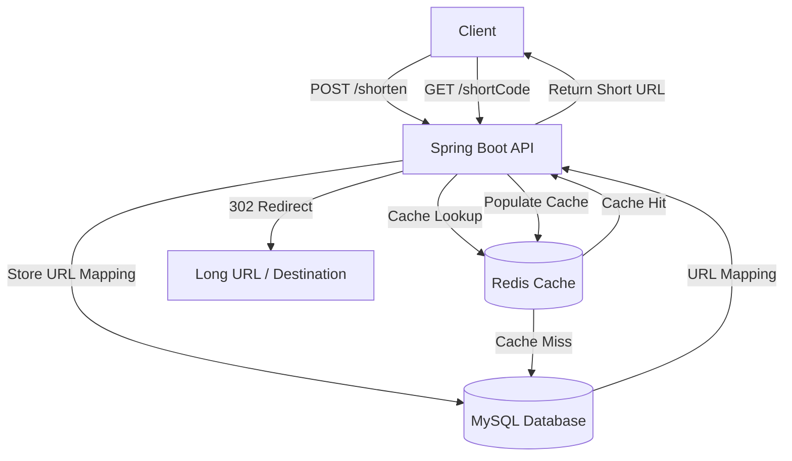

# System Design

## High-Level Architecture

The URL shortener follows a cache-aside architecture where MySQL is the source of truth and Redis is used as a performance cache to reduce database load for frequently accessed short URLs.

### Architecture Diagram



---

## Request Flow

### 1. Create Short URL

The client sends a request to create a short URL.

```text
Client
   |
   | POST /shorten
   v
Spring Boot API
   |
   | Generate unique ID
   | Encode ID using Base62
   |
   | Store URL mapping
   v
MySQL
   |
   | URL successfully stored
   v
Spring Boot API
   |
   | Return short URL
   v
Client
```

Example:

```text
Long URL
    |
    v
Database-generated ID
    |
    | Base62 encoding
    v
Short Code
```

For example:

```text
12543 → d3F
```

---

### 2. Redirect Short URL

When a user clicks a short URL, the request is handled by the Spring Boot API.

```text
Client
   |
   | GET /{shortCode}
   v
Spring Boot API
   |
   | Cache Lookup
   v
Redis
   |
   +----------------------+
   |                      |
Cache Hit              Cache Miss
   |                      |
   v                      v
Return URL              MySQL
                          |
                          | Retrieve URL Mapping
                          v
                        Redis
                          |
                          | Populate Cache
                          v
                    Spring Boot API
                          |
                          | HTTP 302 Redirect
                          v
                     Long URL
                          |
                          v
                     Destination
```

### Cache Hit

If the short code exists in Redis:

```text
Client
   ↓
Spring Boot API
   ↓
Redis
   ↓
Cache Hit
   ↓
Long URL
   ↓
HTTP 302 Redirect
   ↓
Destination
```

The database does not need to be queried.

### Cache Miss

If the short code is not present in Redis:

```text
Client
   ↓
Spring Boot API
   ↓
Redis
   ↓
Cache Miss
   ↓
MySQL
   ↓
Retrieve URL Mapping
   ↓
Store in Redis
   ↓
HTTP 302 Redirect
   ↓
Destination
```

---

## Components

### Spring Boot API

Responsible for:

- Handling API requests
- Creating short URLs
- Generating unique IDs
- Encoding IDs using Base62
- Looking up URL mappings
- Checking expiration and other business rules
- Returning HTTP 302 redirects
- Handling cache and database interactions

### MySQL

MySQL is the **authoritative source of truth** for URL mappings.

It stores the persistent URL data, including the relationship between the short code and the original long URL.

### Redis

Redis is used as a **performance cache** for frequently accessed URL mappings.

Its purpose is to reduce database load and provide low-latency lookups for redirect requests.

Redis is not the source of truth.

### Destination

The destination is the original long URL associated with the short code.

The URL shortener returns an HTTP `302 Found` response with the destination URL in the `Location` header.

---

## Data Consistency

### Consistency Guarantees

URL mappings require strong consistency. Once a URL is successfully created, subsequent requests must be able to retrieve the mapping.

Analytics data can use eventual consistency because a small delay in reporting click metrics is acceptable.

### Read-After-Write Behavior

After `POST /shorten` returns a successful response, a subsequent `GET /{shortCode}` must be able to retrieve the newly created URL without requiring a delay.

### Cache vs Database Consistency

MySQL is the authoritative source of truth, while Redis is used as a performance cache.

Redis may temporarily contain stale or missing data, but it must not override the authoritative state in MySQL.

Cache entries will be invalidated or refreshed when the underlying data changes, with TTL providing an additional safety mechanism.

---

## Short Code Strategy

The system uses a **database-generated unique ID + Base62 encoding** strategy.

The database ID guarantees uniqueness, while Base62 converts the numeric ID into a compact, URL-friendly representation.

Since each database ID is unique and Base62 provides a deterministic one-to-one encoding, different IDs cannot produce the same short code. Therefore, no separate collision-resolution mechanism is required.

Example:

```text
Unique Database ID
       ↓
   Base62 Encode
       ↓
   Short Code
```

For example:

```text
12543 → d3F
```

This approach is simple, deterministic, efficient, and avoids the collision checks required by random or truncated hash-based approaches.

---

## Design Decisions

| Decision | Choice | Reason |
|---|---|---|
| Application | Spring Boot | Java-based backend framework |
| Database | MySQL | Persistent source of truth |
| Cache | Redis | Low-latency reads and reduced DB load |
| Short Code | ID + Base62 | Unique, compact, deterministic |
| Redirect | HTTP 302 | Keeps the short URL under application control |
| URL Mapping Consistency | Strong | Ensures newly created URLs are immediately readable |
| Analytics Consistency | Eventual | Small reporting delays are acceptable |
| Cache Strategy | Cache-Aside | Read from cache first, DB on cache miss |